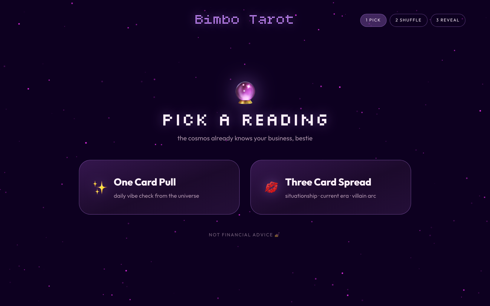
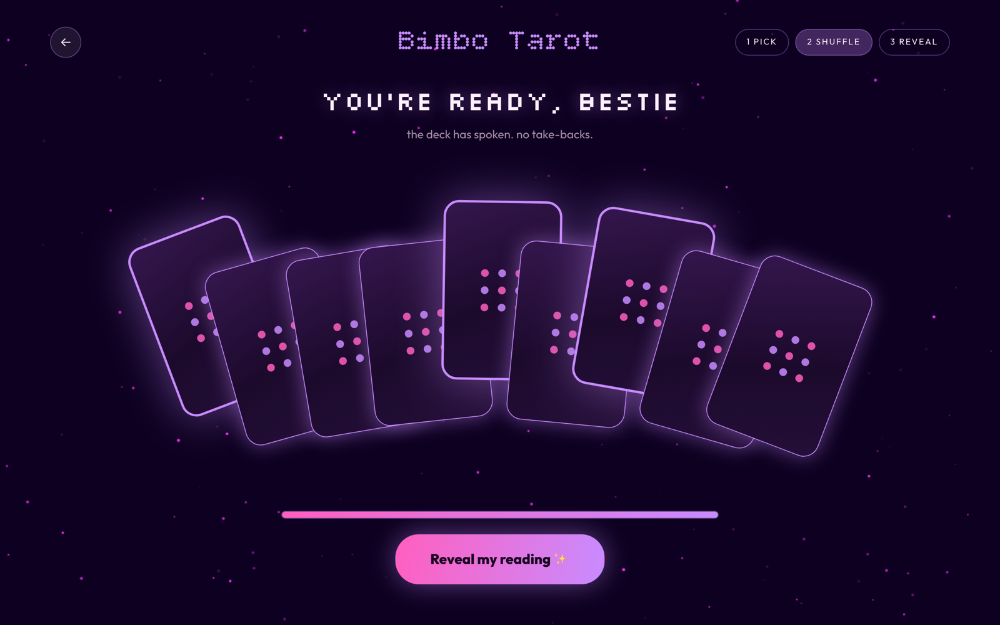
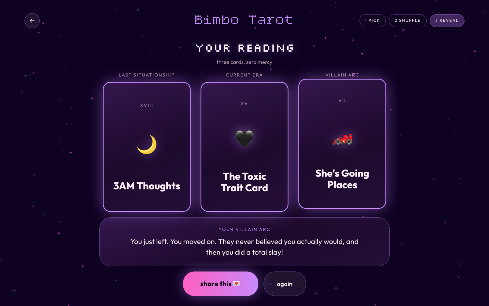
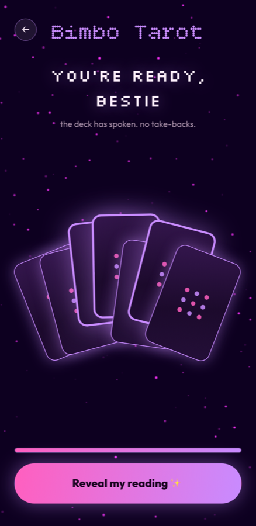
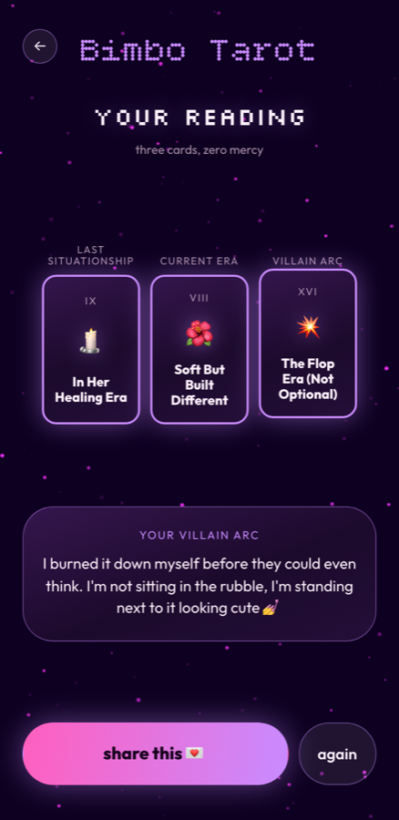

# Bimbo Tarot

A tarot app that reads you for filth. Pick a spread, drag across the deck to shuffle it,
choose your cards from the fan, and flip them one by one.

**[Try it →](https://tjllis.github.io/bimbo_tarot/)**



## The reading

Three steps, and the header tracks which one you're on.

| 1 · pick | 2 · shuffle | 3 · reveal |
| --- | --- | --- |
| Choose a one-card pull or a three-card spread. | Drag across the deck until the bar fills — or admit defeat and hit "shuffle for me, I'm tired". Then pick your cards out of the fan. | The cards you chose fly into their slots. Flip each one to read it. |





A **one-card pull** gives you today's general reading. A **three-card spread** reads the same
deck three different ways — the same card means one thing as your last situationship and
something else entirely as your villain arc.

"share this 💌" copies the whole reading to your clipboard, ready to paste into the group chat.

## On a phone

Same app, not a shrunk-down desktop. The fan drops from nine cards to seven and tightens its
arc so it fits a 390px screen, the readings menu stacks, buttons go full-width, the step chips
give up their space, and the copy switches from "click" to "tap".

<p>
  
  
  
</p>

## Running it

```bash
npm install
npm run dev      # http://localhost:5173
```

```bash
npm run build    # typecheck, then bundle to dist/
npm run preview  # serve the built bundle
```

## How it's built

React 19 + TypeScript on Vite, CSS Modules, no runtime dependencies beyond React. No router —
the three screens are one piece of state.

```
src/
├── main.tsx                  entry
├── index.css                 design tokens, keyframes, view-transition timing
├── App.tsx                   screen switch + responsive tuning
├── data/deck.ts              the 22 cards and the three spread positions
├── lib/fan.ts                deal + the maths that lays the fan out
├── hooks/
│   ├── useReading.ts         the whole flow: pick → shuffle → reveal
│   └── useMediaQuery.ts      desktop breakpoint, for the parts CSS can't do
├── components/               AppHeader · Button · CardBack · StarCanvas
└── screens/                  PickScreen · ShuffleScreen · RevealScreen
```

A few things worth knowing if you're poking at it:

**One hook owns the reading.** [`useReading`](src/hooks/useReading.ts) holds the screen, the
shuffle amount, which fan slots you picked, and which cards you've flipped. Screens are pure
props — they render what they're handed and call back.

**The fan is maths, not hand-placed.** [`fanLayout`](src/lib/fan.ts) turns the shuffle amount
into a position, rotation, lift, and glow for every card. Its wobble comes from a seeded
`sin`, so re-renders never re-scatter the deck — only a bumped seed does. Phone and desktop
pass different tunings to the same function.

**Two layouts, one breakpoint** at 1000px — wide enough for a fully-opened nine-card fan.
Almost all of it is CSS custom properties; only the fan geometry and the click/tap wording
need JavaScript to know which side of the line they're on.

### The star field is a canvas

[`StarCanvas`](src/components/StarCanvas/StarCanvas.tsx) is a fixed, full-viewport
`<canvas>` sitting behind the app at `z-index: 0` with `pointer-events: none`, so it never
intercepts a drag meant for the deck.

160 stars are generated once, each with its own position, radius, drift speed, and — the
part that matters — a random starting **phase**:

```ts
const opacity =
  0.15 + 0.85 * (0.5 + 0.5 * Math.sin(n * 0.005 * star.speed + star.phase));
```

`Math.sin` returns -1…1, so `0.5 + 0.5 * sin` maps to 0…1, and the `0.15` floor stops any
star blinking fully out. Because every star gets a different phase and speed, they twinkle
independently instead of pulsing in unison, which is what makes it read as a sky rather than
a flashing overlay.

The loop runs on `requestAnimationFrame`, and a `ResizeObserver` keeps the canvas's
**drawing buffer** (`canvas.width/height`) in sync with its **laid-out size**
(`offsetWidth/Height`). Those are two different things — let them drift apart and the whole
sky renders stretched. The effect cleans up after itself: cancel the frame, disconnect the
observer.

Why a canvas and not CSS? 160 independently-phased elements animating every frame is a lot
of nodes for the compositor to juggle. One canvas draws the lot in a single pass per frame,
and nothing lands in the DOM.

### Cards fly between screens

Going from the fan to the reading used to be a hard cut. Now the cards you picked physically
travel into their slots, using the
[View Transitions API](https://developer.mozilla.org/en-US/docs/Web/API/View_Transition_API).

The whole trick is giving the *same* `view-transition-name` to the card in both screens. The
browser then treats them as one element that moved, and interpolates position, size, and
rotation itself — no FLIP maths, no measuring.

```tsx
// ShuffleScreen — the card sitting in the fan
viewTransitionName: isPicked ? `card-${i}` : undefined

// RevealScreen — the same card in its slot
<div className={styles.cardFrame} style={{ viewTransitionName: `card-${index}` }}>
```

The state change is wrapped so the browser can snapshot before and after
([`useReading`](src/hooks/useReading.ts)):

```ts
start(() => flushSync(update));
```

`flushSync` is load-bearing. React batches by default, so without it the callback returns
before the DOM has actually changed and the browser snapshots the *old* state twice.

Timing lives in [`index.css`](src/index.css) — 520ms for the cards on a decelerating curve,
340ms for the cross-fade of everything else, so the cards land last and read as the subject.

**One trap worth knowing:** `view-transition-name` forces the element's *used*
`transform-style` to `flat`. Put it on the flipper itself and the 3D context dies, which
silently breaks `backface-visibility` — the card rotates but never shows its face.
`getComputedStyle` still reports `preserve-3d`, so it's invisible in DevTools. Hence the
`.cardFrame` wrapper: it carries the name, the flipper keeps its 3D.

Two fallbacks, both feature-detected rather than sniffed:

```css
@supports not (view-transition-name: none) {
  /* no view transitions: deal the cards in, 90ms apart */
}
@supports (view-transition-name: none) {
  /* view transitions: turn off the screen-level pop so they don't fight */
}
```

And `prefers-reduced-motion: reduce` skips the transition entirely for a plain swap.

## Deploying

Pushing to `main` deploys automatically via
[`.github/workflows/deploy.yml`](.github/workflows/deploy.yml) — it builds and publishes
`dist/` to GitHub Pages.

One-time setup: **Settings → Pages → Source → GitHub Actions**.

The one thing that will bite you is the base path. Pages serves the site from
`/<repo-name>/`, not from the domain root, so a default build asks for `/assets/index.js`
and gets a 404 — a blank page with no obvious cause. The workflow handles it:

```yaml
- run: npm run build -- --base=/${{ github.event.repository.name }}/
```

Deriving it from the repo name rather than hardcoding means a rename won't silently break
the deploy, and local `npm run dev` keeps working at `/`.
